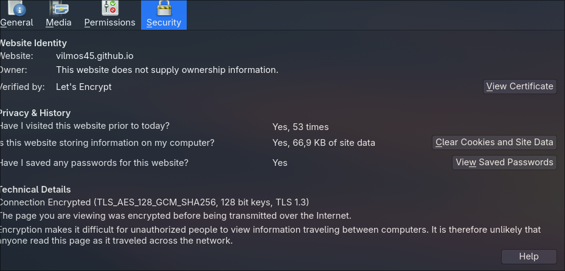
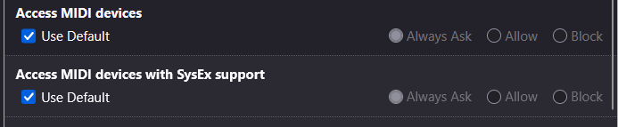
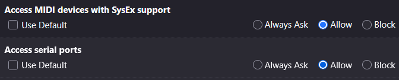

# easySinth

If you want to use your MIDI controller with this synth, you must enable our webpage to acces your MIDI inputs (you have to do this only once):
In firefox it's easy:
1. Click the shield icon in the search bar. 
2. Select the "Connection secure" button with a lock icon.
3. Open: "More site information". 
4. Go to the Permissions tab.
5. Scroll down until you find MIDI devices settings. 
6. Unselect the use default checkbox, and click allow, on both of the permissions. 
7. Now you can close this window (or pop-up), and enjoy your MIDI device!

In chromium based browsers:
1. Give up! :(